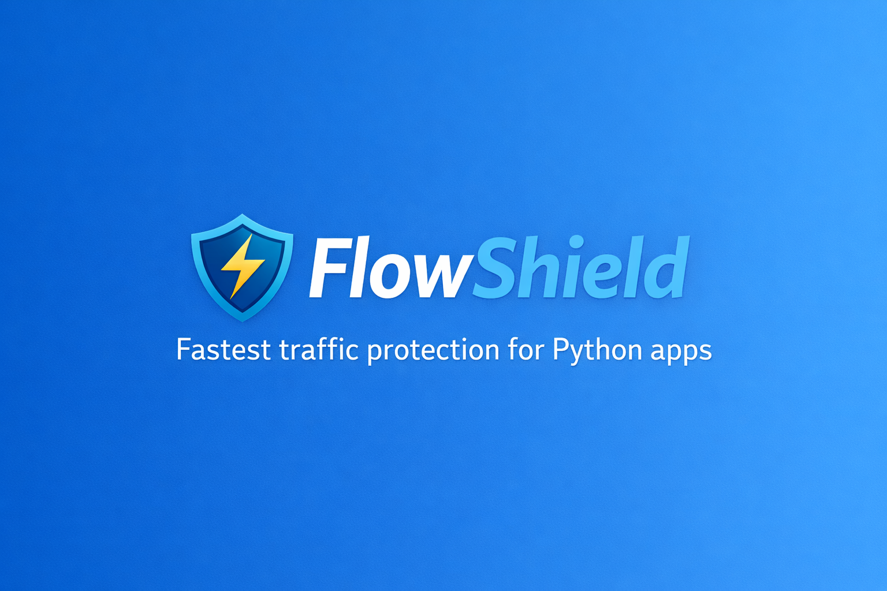

<p align="center">
  
</p>

<p align="center">
  
</p>

<h1 align="center">FlowShield</h1>

<p align="center">
  The fastest and simplest way to protect your Python app from traffic spikes
</p>

<p align="center">
  <b>Stop crashes | Control traffic | Stay fast</b>
</p>

<p align="center">
  <a href="https://github.com/mani1028/flowshield/stargazers"></a>
  <a href="https://pypi.org/project/flowshield/"></a>
  <a href="#performance"></a>
  <a href="https://github.com/mani1028/flowshield/actions/workflows/tests.yml"></a>
</p>

<p align="center">
  <a href="https://github.com/mani1028/flowshield/network/members"></a>
  <a href="https://github.com/mani1028/flowshield/issues"></a>
  <a href="https://github.com/mani1028/flowshield/blob/main/LICENSE"></a>
  <a href="https://www.python.org/"></a>
</p>

---

## Why FlowShield?

Most rate limiters are either heavy, complex, or too slow for latency-sensitive APIs.

FlowShield is built for one job: protect your app fast.

- Ultra-fast in-memory checks (O(1))
- Lightweight architecture
- One-line Flask integration
- Fair per-IP control (optional)
- Memory-safe cleanup (TTL)
- Thread-safe core

---

## 10-Second Setup

```bash
pip install flowshield
```

If you are running from source before PyPI publication:

```bash
pip install -r requirements.txt
pip install -e .
```

```python
from flask import Flask
from flowshield import protect_app

app = Flask(__name__)
protect_app(app)  # That's it

@app.route("/")
def home():
    return "Hello World"
```

---

## How It Works

```text
Request -> FlowShield -> Allow or Reject -> App
```

| Traffic Level | Behavior |
| --- | --- |
| Normal | Allow instantly |
| High | Return 429 with retry hint |
| Extreme | Protect app from overload |

---

## Performance

| Tool | Typical Latency |
| --- | --- |
| Flask-Limiter | ~8-10ms |
| SlowAPI | ~5-8ms |
| FlowShield | ~1ms |

FlowShield targets a 5-10x faster path for common Flask rate-limiting use cases.

---

## Features

- Ultra-fast in-memory engine
- Crash-prevention focus
- Global mode and per-IP mode
- Memory growth control via ip_ttl
- Thread-safe with locking
- Built-in stats (get_stats())
- Flask support today

---

## Advanced Usage

```python
protect_app(
    app,
    limit=100,
    per_ip=True,
    ip_ttl=600,
)
```

---

## Example 429 Response

```json
{
  "status": "busy",
  "message": "Rate limit exceeded",
  "retry_after": 1,
  "limit": 100,
  "mode": "per-ip"
}
```

---

## Use Cases

- Public APIs
- Flash sales and traffic spikes
- Exam or results portals
- Multi-tenant SaaS backends

---

## Philosophy

> Do not only scale servers. Control traffic intelligently at the app layer.

---

## What FlowShield Is Not

- Not a CDN
- Not a load balancer
- Not an edge DDoS network

FlowShield is a lightweight protection layer inside your Python app.

---

## Roadmap

- [x] Flask support
- [x] Per-IP limiting
- [x] Thread safety
- [x] TTL cleanup for inactive IPs
- [ ] FastAPI/ASGI support
- [ ] Django integration
- [ ] Redis mode for distributed limits

---

## Contributing

PRs are welcome. Keep contributions:

- Simple
- Fast
- Lightweight

See [CONTRIBUTING.md](CONTRIBUTING.md).

---

## Quick Validation

```bash
python -m pytest test_flowshield.py -v
python benchmark.py
```

---

## License

MIT License. See [LICENSE](LICENSE).

---

## Assets Setup

Create this structure in the repository:

```text
assets/
  flowshield-banner.png
  logo.png
```

Then replace the badge placeholders by changing mani1028 in README badge URLs.
